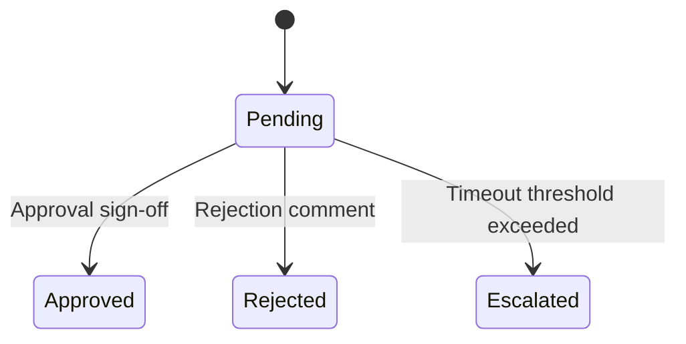

# Multi-Level Approvals Engine

Handles multi-level, sequential approvals and escalation routines.

## Flow States

## Escalations
When a level timeout is hit, the request escalates to the parent role group or administrative user.
