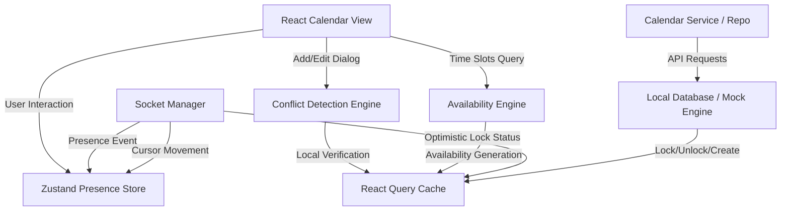
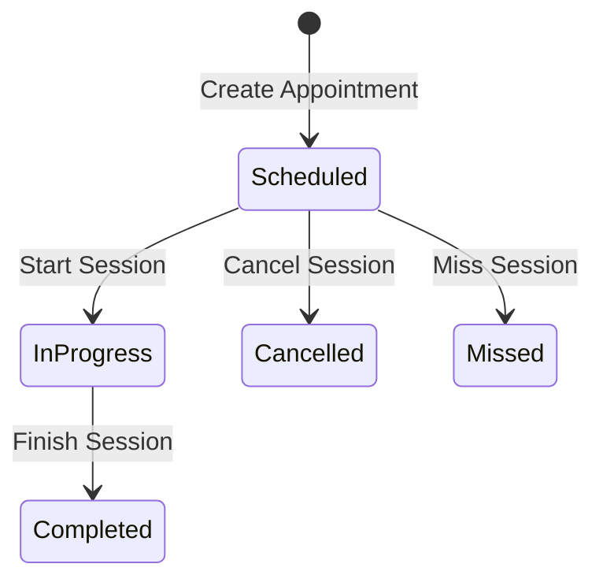

# Enterprise Live Calendar Collaboration & Resource Scheduling

This document details the architectural design and implementation details for the Live Calendar Collaboration and Resource Scheduling system in Rezk Fit Hub Enterprise.

---

## 1. System Architecture Diagram

---

## 2. Realtime Collaboration & Presence

### 2.1 Co-presence Indicators
- Active collaborators viewing or editing the calendar are tracked via the Zustand store `useCalendarPresenceStore`.
- The user list updates instantly on `PRESENCE_UPDATED` events received from the socket sync manager.

### 2.2 Dynamic Cursor Layer
- Cursors are tracked locally on the calendar view container using coordinates `(x, y)` relative to the viewport.
- The coordinate movements are throttled and broadcasted, allowing co-viewers to see real-time cursor arrows with distinct name tags on the viewport.

---

## 3. Optimistic Appointment Locking

### 3.1 Lock State Protocol
- When an editor opens the **Add/Edit Appointment Dialog** for an existing session:
  1. An optimistic lock request (`lock`) is dispatched to the backend.
  2. The session status is updated to include a `lock` property containing `isLocked: true`, `lockedBy`, and `lockedAt`.
- The lock held by another coach prevents any override saves. The "Save" button is disabled and a warning banner in Arabic is shown:
  `⚠️ هذا الموعد قيد التعديل حالياً بواسطة (الاسم).`

### 3.2 Lock Timeout & Auto-Unlock
- Locks automatically expire in the database after **60 seconds** to avoid deadlock situations if a user exits the browser or loses connection.
- When closing the dialog normally or canceling, an `unlock` API request is dispatched to release the lock immediately.

---

## 4. Conflict & Availability Engines

### 4.1 Conflict Detection Engine (`conflict-detection.js`)
Detects resource collisions and validates branch limitations:
1. **Coach overlap**: Prevents a coach from having multiple scheduled appointments at the same time.
2. **Nutritionist overlap**: Prevents nutritionist consultants from overlapping sessions.
3. **Room capacity**: Blocks room bookings if the same room is occupied during the selected timeframe.
4. **Equipment constraints**: Ensures fitness/cardio equipment is not double-booked.
5. **Branch capacity limit**: Enforces maximum concurrency levels per branch:
   - **Branch 1 (Main Riyadh)**: Max 5 concurrent sessions.
   - **Branch 2 (Jeddah)**: Max 3 concurrent sessions.

### 4.2 Availability Slot Engine (`availability-engine.js`)
Generates 60-minute time intervals between working hours (08:00 - 22:00) excluding:
- Friday weekends and national holidays.
- Hours that conflict with existing appointments.
- Timeframes where resources (coaches, rooms) are fully utilized.

### 4.3 Recurrence Engine (`recurring-appointments.js`)
Supports generating future event occurrences for scheduling loops (Daily, Weekly, Monthly) up to specific counts or end dates, skipping weekend rest days and holidays automatically when `skipHolidays` is checked.

---

## 5. Scheduling Lifecycle

The lifecycle of an appointment in Rezk Fit Hub Enterprise involves several stages, ensuring data consistency and conflict prevention in a collaborative environment:

1. **Initialization**: A user selects an empty cell/slot or clicks "New Appointment". The dialog requests available slots from the `Availability Engine`, showing only conflict-free slots.
2. **Conflict Checking**: As form fields (coach, client, room, branch, time) change, the `Conflict Detection Engine` runs debounced (350ms) validations to discover overlaps. If conflicts are found, warnings are displayed in Arabic.
3. **Optimistic Locking**: When opening an existing appointment for editing, a lock request is sent, updating the lock state in the database and broadcasting it to other collaborators. The lock automatically releases after **60 seconds** or upon canceling/saving.
4. **Broadcast & Cache Synchronization**: On saving, editing, or canceling:
   - CRUD API request updates the database repository.
   - An event is published to the `eventBus` (`APPOINTMENT_CREATED`, `APPOINTMENT_UPDATED`, `APPOINTMENT_DELETED`).
   - The `Query Cache Synchronizer` captures the event and invalidates related query keys in the React Query cache.
   - All open UI screens refresh automatically, rendering the updated data without reload.
