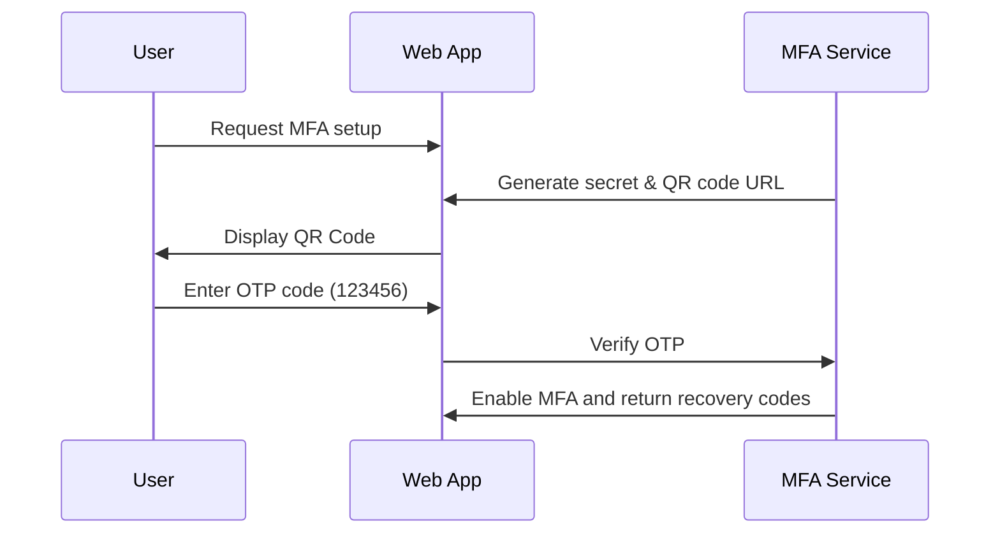

# Multi-Factor Authentication (MFA) Integration Guide

Rezk Fit Hub supports TOTP (Time-based One-Time Passwords) for accounts.

## MFA Lifecycle

## Emergency Recovery Flow
If users lose authenticator device access, they can authenticate using one of their 8 recovery codes.
Once a recovery code is used, it is revoked.
