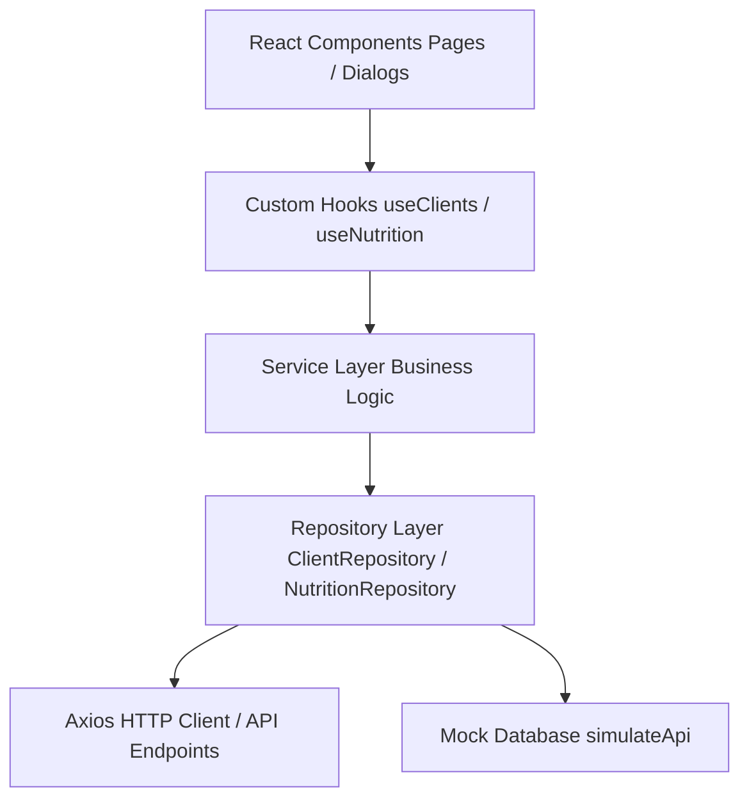
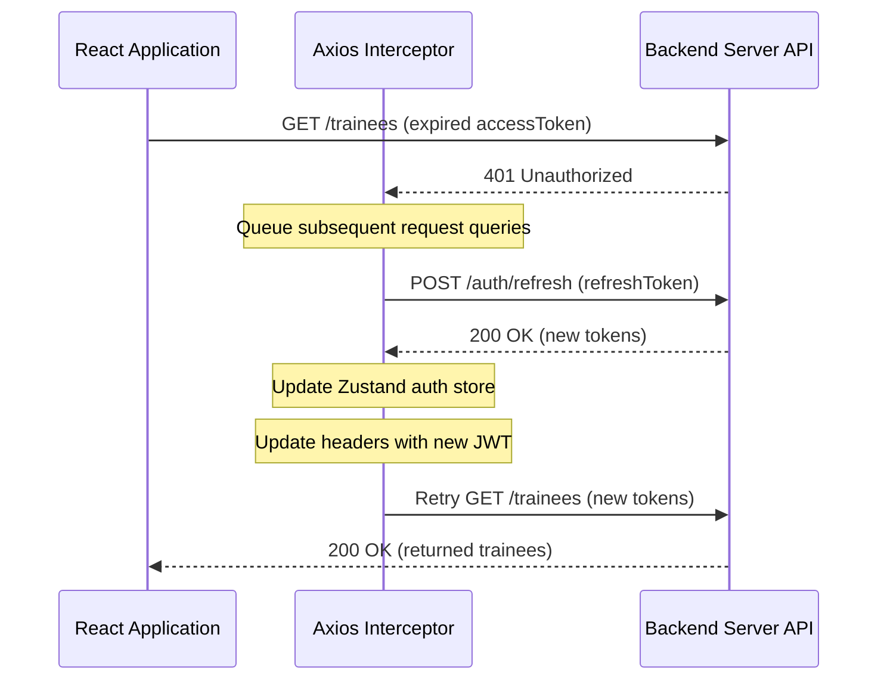

# Rezk Fit Hub — Coach Trainee Portal

A premium React-based dashboard for coaches to manage client trainees, customize nutrition diet plans, catalog exercise routines, and track body transformation metrics.

---

## 1. Project Architecture

The application is structured around a decoupled, highly testable **Hooks $\rightarrow$ Services $\rightarrow$ Repositories** design pattern:



* **Presentation Layer (UI)**: Pure visual component trees built on Tailwind CSS, framer-motion, and shadcn-ui. Expose states and delegates data fetch directly to custom hooks.
* **State & Query Hook Layer**: Manages fetching states, caching query keys, page transitions, and mutation reactions using TanStack React Query.
* **Business Service Layer**: Acts as an intermediary mapping controller operations and managing shared validation triggers.
* **Repository Layer**: Bridges raw data transfer. Converts data schemas using Zod validation parser contracts and isolates mock environments from live server endpoints.

---

## 2. Folder Structure

```
rezk-fit-hub/
├── .github/
│   └── workflows/
│       └── frontend.yml        # CI/CD GitHub Actions Pipeline
├── docs/
│   └── API_CONTRACTS.md       # API Specification contracts (DTOs)
├── src/
│   ├── api/
│   │   ├── axios.js           # Central Axios client (interceptors, queues)
│   │   ├── endpoints.js       # Centralized API specification endpoints registry
│   │   ├── errors.js          # Unified custom ApiError classes
│   │   └── error-handler.js   # Global API error normalizer
│   ├── components/            # Reusable UI widgets and dialog containers
│   ├── config/
│   │   └── app.config.js      # Centralized App configuration profile
│   ├── constants/
│   │   └── queryKeys.js       # Standardized TanStack Query cache keys
│   ├── contracts/             # Zod validation schema schemas (DTO validation)
│   ├── hooks/                 # Custom React and TanStack React Query hooks
│   ├── mocks/                 # In-memory mock database and mock handlers
│   ├── pages/                 # Full screen routing pages (Clients, Nutrition, etc.)
│   ├── repositories/          # Repository layers parsing live or simulated API data
│   ├── services/              # Business services layer
│   ├── store/                 # Zustand authentication and session states
│   └── utils/                 # Global utilities (logger, calculations, formatting)
├── .env.development           # Local Mock Profile
├── .env.staging               # Staging Server Profile
├── .env.production            # Production Server Profile
└── README.md                  # System Documentation
```

---

## 3. Running Locally

### Prerequisites
* Node.js version 20.x or higher
* npm package manager

### Steps
1. Clone the repository and navigate to the directory:
   ```sh
   cd rezk-fit-hub
   ```
2. Install dependencies securely:
   ```sh
   npm ci
   ```
3. Boot local development server:
   ```sh
   npm run dev
   ```
   Open `http://localhost:8080` in your web browser.

---

## 4. Environment Variables & Profiles

The system loads profile configurations based on active profiles.

* **`.env.development`**: Configured for local offline mock database development (`VITE_ENABLE_MOCK_API="true"`).
* **`.env.staging`**: Configured for staging checks against an integration server (`VITE_ENABLE_MOCK_API="false"`).
* **`.env.production`**: Optimized config for production deployment with errors-only logs and live endpoints.

### Key Environmental Variables
* `VITE_API_BASE_URL`: Live server URL (e.g. `https://api.rezkfithub.com/api`).
* `VITE_ENABLE_MOCK_API`: Enables/disables local simulated mock database.
* `VITE_REQUEST_TIMEOUT`: Axios query timeout limit in milliseconds.
* `VITE_ENABLE_DEVTOOLS`: Displays TanStack Query devtools panel.
* `VITE_LOG_LEVEL`: Logs detail controls (`debug`, `info`, `warn`, `error`).

---

## 5. Mock Mode vs. API Mode

* **Mock Mode (`VITE_ENABLE_MOCK_API="true"`)**: Repositories intercept operations and query local in-memory DB arrays. Enables full CRUD simulation without local backend setups.
* **API Mode (`VITE_ENABLE_MOCK_API="false"`)**: Repositories execute HTTP requests using Axios. Schema validation is run on response arrays to reject corrupted backend data shapes.

---

## 6. React Query & Cache Key Hardening

Query keys are kept fully deterministic:
* Trainees List: `['clients', 'list', { page, limit, search, status }]`
* Diet Plans List: `['nutrition', 'plans', { page, limit, search, status }]`

Mutations target parent sub-arrays using prefix-based query key invalidation:
```javascript
queryClient.invalidateQueries({ queryKey: QUERY_KEYS.clients.all });
```
This forces all active, paginated pages of clients to reload fresh datasets on next render.

---

## 7. Authentication & Token Silent Rotation



The system secures sessions using Zustand state persistence and localStorage:
* **Silent Refresh**: On 401 Unauthorized responses, Axios interceptor pauses incoming requests, fires one single token rotation refresh call, updates Zustand store tokens, and retries queued calls.
* **Unrecoverable Session**: If token refresh fails or the refresh token is missing, the session is cleared and the user is redirected to the `/login` route.

---

## 8. Testing

We use **Vitest** for running unit, layout, and HTTP integration mock tests:

* Run all tests:
  ```sh
  npm run test
  ```
* Run with code coverage report:
  ```sh
  npm run test:coverage
  ```

---

## 9. Verification & Build

* **Linting Checks**: Verified using ESLint:
  ```sh
  npm run lint
  ```
* **Production Build Compilation**: Bundled using Vite:
  ```sh
  npm run build
  ```

---

## 10. Version History

* **v1.0.0**: Initial Release containing dashboard statistics widgets, trainee profile CRUD dialogues, and diet plan creation.
* **v2.3.0**: Upgraded list pagination, debounced search filters, delete-on-last-page safety guards, and HTTP integration tests using MSW.
* **v2.4.0** *(Current)*: API standardization, global HTTP error handlers, environment profiles, unified logger, and CI/CD GitHub Actions foundation.
