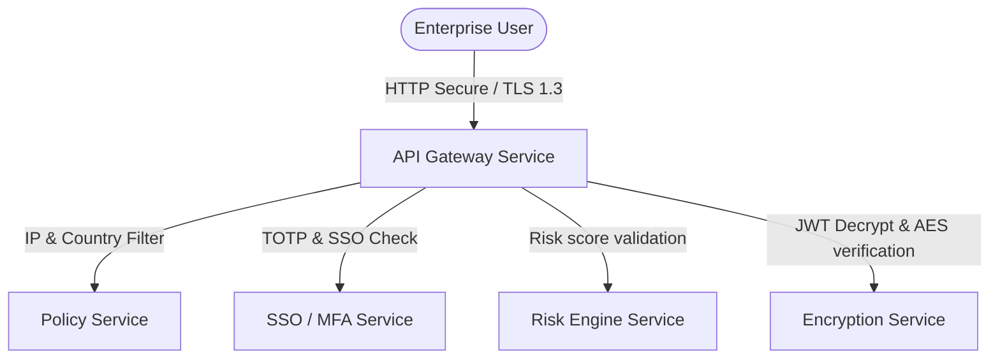

# Rezk Fit Hub Security Architecture

Rezk Fit Hub enforces strict security boundaries at every layer.

## Architecture Blueprint

## Security Controls
1. **API Protection**: Gateways, rate limits, and scopes.
2. **Access Control**: Role-based access validation (RBAC) and IP allowlists.
3. **Data Security**: Secrets management, AES-256 local and DB encryption.
4. **Threat Detection**: Impossible travel alerts, IP velocity checking.
