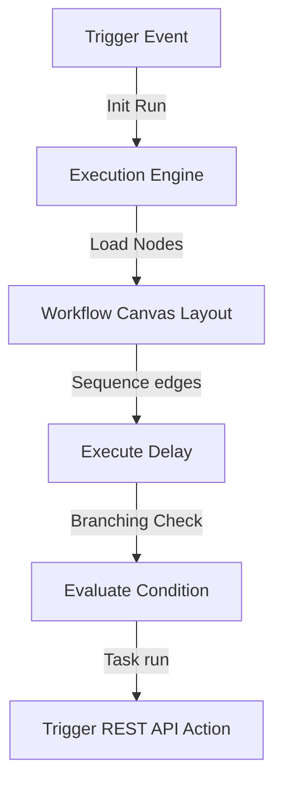

# Visual Workflow Engine Specification

Rezk Fit Hub provides a Visual Workflow Builder powered by Zod-validated node configurations.

## Architecture

## Features
1. **Drag-and-Drop Editor**: Visual arrangement of Triggers, Actions, Conditions, and Approvals.
2. **Sequential/Parallel Execution**: Processing workflows with complex edge pathways.
3. **Recovery**: Action rollbacks on node run failures.
