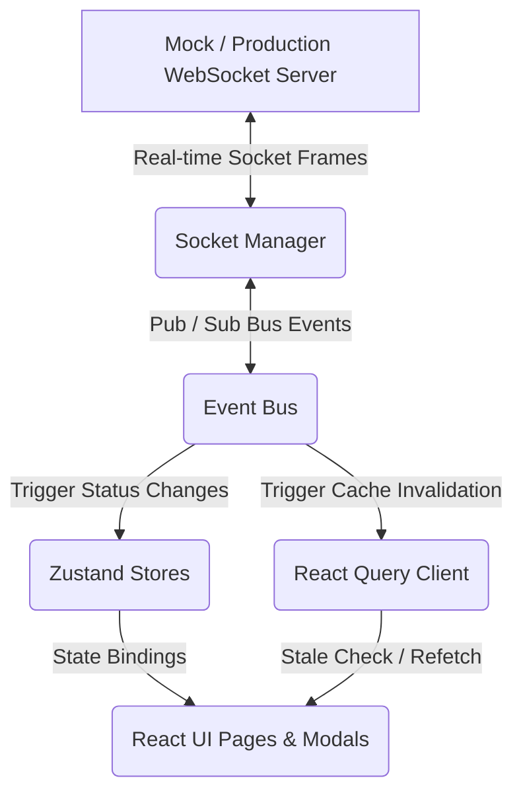

# Rezk Fit Hub — Enterprise Collaboration Architecture

This document describes the high-level architecture of the real-time collaboration engine implemented in Rezk Fit Hub.

## Architectural Overview

Rezk Fit Hub uses a decoupled, event-driven architecture to coordinate state synchronization, editing locks, and chat notifications across multiple concurrent clients.

## Key Modules

### 1. Connection Lifecycle Manager
- **Zustand Store** (`useRealtimeStore`): Tracks `isConnected`, `latency` metrics, `reconnectAttempts`, and WebSocket version.
- **Service** (`socketManager`): Handles connecting/disconnecting transitions, ping/pong heartbeats, and re-connection loops.
- **Simulation** (`mockRealtime`): Runs client-side intervals emitting presence, cursors, lock durations, and connection drop simulations.

### 2. Event Bus (`eventBus`)
- Decouples UI modules from direct socket connections.
- Implements standard pub/sub API: `subscribe(eventName, callback)` and `publish(eventName, payload)`.

### 3. Query Synchronizer (`query-synchronizer.js`)
- Subscribes to collaboration bus events.
- Invalidates corresponding TanStack Query caches (e.g. invalidating `['clients']` on `CLIENT_UPDATED` or `['comments', type, id]` on `COMMENT_CREATED`).
- Conducts optimistic UI updates for chat threads to guarantee sub-millisecond perceived latency.

### 4. Lock Engine (`useEntityLock`)
- Establishes a soft/hard lock model.
- Prevents concurrent modifications on trainees (Clients), tasks, calendars, documents, and roles matrices.
