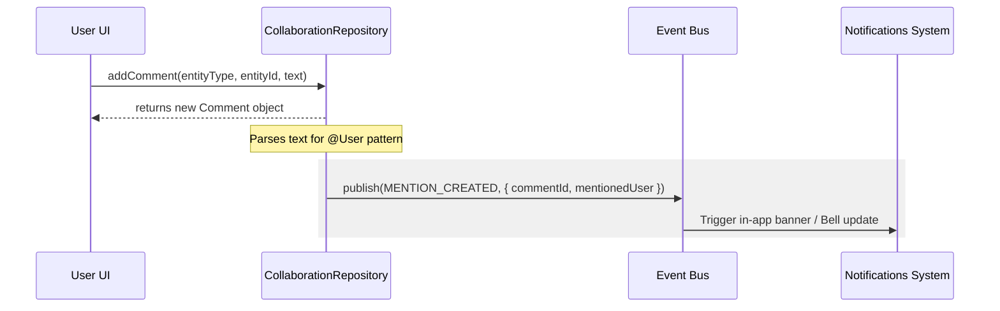

# Rezk Fit Hub — Comments & Mentions System

This document outlines the design, data model, and flow of the Comments and Mentions collaboration engine in Rezk Fit Hub.

## Data Model

Comments are validated using Zod contracts (`CommentSchema` in `collaboration.contract.js`) and have the following structure:

```typescript
interface Comment {
    id: number;
    entityType: 'Client' | 'Task' | 'Document' | 'Appointment' | 'Analytics';
    entityId: number | string;
    text: string;
    author: string;
    authorAvatar: string;
    timestamp: string;
    isPinned: boolean;
    isResolved: boolean;
    parentId?: number | null;
    reactions: Record<string, string[]>; // { [emoji]: [usernames] }
}
```

## Features

### 1. Mentions Parsing & Triggers
When typing in a comment, typing `@` followed by a user name (e.g. `@الكوتش أحمد`) triggers search suggestions.
On comment submission:
- The text is scanned for `@Name` patterns.
- If a match is found, a `MENTION_CREATED` event is dispatched.
- System notifications are generated for the target user.



### 2. Thread Organization
- **Resolve State**: Allows resolving specific comments (collapsing or fading out) to declutter tasks or documents once issues are closed.
- **Pinning**: Important discussions can be pinned to the top of the comment panel for high visibility.

### 3. Rich Reactions
- Users can toggle reactions (e.g. 👍, 🔥, 💪, ❤️).
- Clicking an existing emoji increments the user count, and clicking again rolls back/toggles the reaction off.
