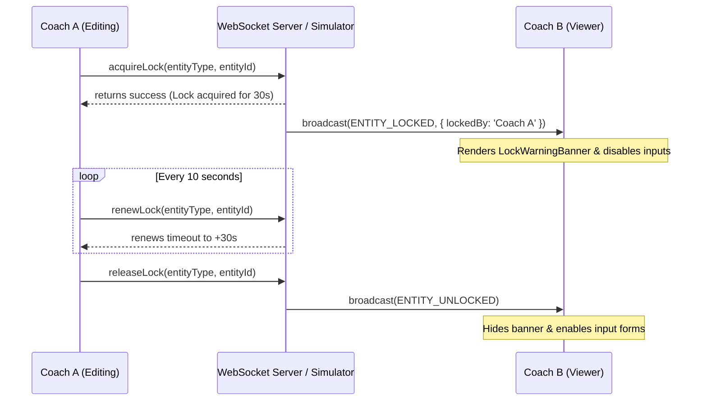

# Rezk Fit Hub — Editing Lock Strategy

This document details the synchronization logic, heartbeat intervals, and lock recovery behaviors implemented for concurrent editing safety.

## Overview

To prevent concurrent write conflicts, Rezk Fit Hub implements a **Soft Lock-out Model** with heartbeat renewals.

## Key Mechanisms

### 1. Lock Duration & Heartbeat Renewals
- **Acquire Lock**: Triggered when a user opens an Edit Dialog. Locks are set with an initial timeout of **30 seconds**.
- **Heartbeat renewal**: A background interval runs every **10 seconds** inside the `useEntityLock` hook to refresh the active lock.
- **Expiration**: If a user loses connection or closes the tab without saving, the lock automatically expires after 30 seconds, restoring edit capabilities for other staff.

### 2. Lock Warning Banner & State Constraints
- When a page or dialog detects a lock owned by another user:
  - The `LockWarningBanner` displays the avatar and name of the editing owner.
  - All form controls (`Input`, `Select`, `Textarea`, `Button`) are disabled via `<fieldset disabled={isLockedByOther}>` wrappers.
  - A **Force Unlock** bypass button is visible for Administrators to release locks in emergency situations.
