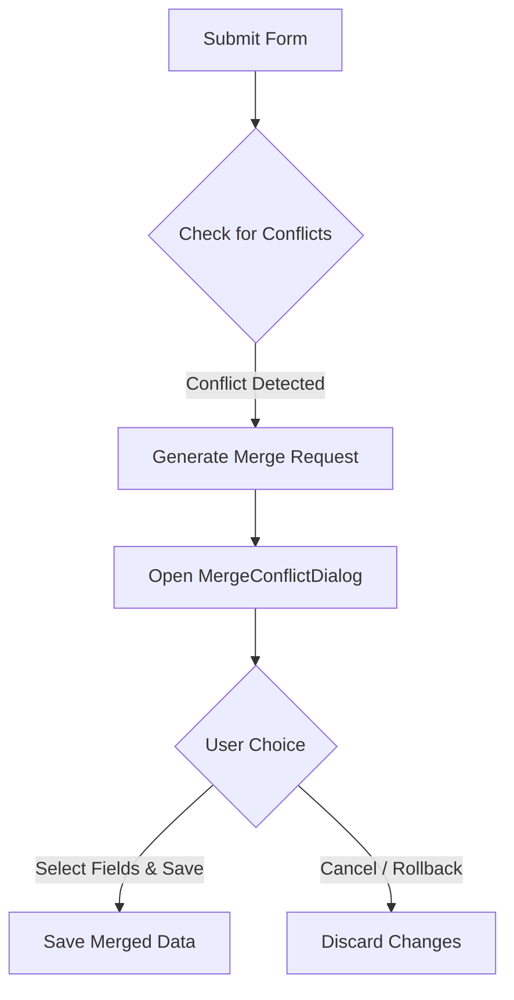

# Rezk Fit Hub — Real-time Cache Sync & Resiliency

This document details the real-time cache synchronization, connection state stores, and optimistic updates flow.

## Resiliency & Connection States

Rezk Fit Hub tracks connection quality parameters to adjust synchronization behaviors dynamically.

### State Store (`useRealtimeStore`)
- `isConnected`: Boolean flag denoting active link status.
- `latency`: Current ping/pong duration in milliseconds.
- `reconnectAttempts`: Track retries during reconnect sequences.

### Recovery Flow
When connection drops:
1. System transitions `isConnected` to `false` and records `lastDisconnectedAt`.
2. Heartbeats stop and UI components enter offline simulation modes.
3. Upon network restoral:
   - A `RECONNECT_SUCCESSFUL` event triggers.
   - TanStack Query is instructed to invalidate all active queries, performing a background refetch to ensure zero stale data is shown.

---

## Conflict Detection & Merge Resolution

When concurrent edits occur, conflicts are resolved using `MergeConflictDialog`:

### Flow Actions
- **Mine**: Local modifications made by the coach.
- **Theirs**: Server state modified concurrently by another team member.
- **Merged**: Default recommendation blending modifications.
- **Resolution**: Accepting the merge writes the selected fields to the database.
- **Rollback**: Discarding updates prevents writing corrupted intermediate values.
