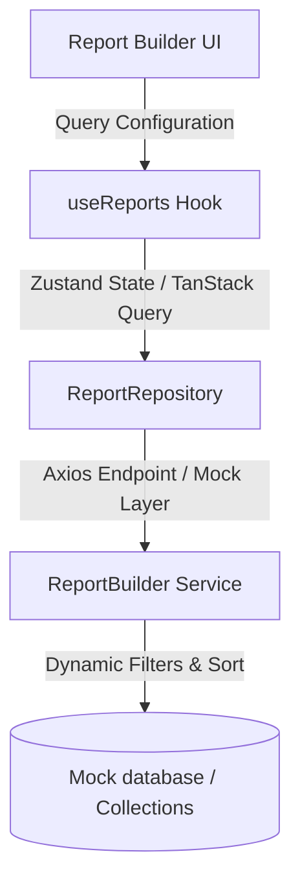

# Reporting Engine Architecture

The Reporting Engine in Rezk Fit Hub is a modular framework built to generate, sort, filter, and group tabular reports from all primary business models.

## Architectural Flow

## Supported Business Modules

1. **Clients (المشتركين)**: Subscription status, registration progress, active trainers.
2. **Calendar (المواعيد)**: Session schedules, coach/room occupancy.
3. **Tasks (المهام)**: Administrator tasks, priorities, overdue schedules.
4. **Nutrition (التغذية)**: Caloric limits, macronutrient profiles.
5. **Exercises (التمارين)**: Training repetitions, difficulties, categories.
6. **Messages (الرسائل)**: Text logs, sender/recipient histories.
7. **Analytics (المالية)**: Revenue charts, subscription pricing.
8. **Documents (المستندات)**: Upload history, sizes, extensions.
9. **Audit Logs (سجلات العمليات)**: Security audits, administrative activities.
10. **Notifications (التنبيهات)**: In-app system notification records.

## Data Schema Validation (Zod)

Dynamic boundaries enforce Zod parsing (`parseApiResponse`) before data is passed to UI states:

* **ReportSchema**: Validates report names, filter criteria, and snapshot previews.
* **ReportTemplateSchema**: Schema validation for executive templates.
